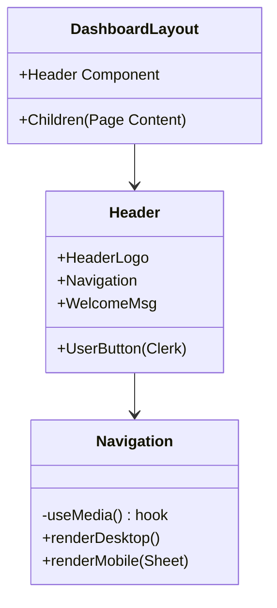

# Developer Log & Architectural Decisions

## [2026-01-05] Task: Dashboard UI & Navigation Setup

### 1. Architectural Decision (ADR)
- **Context**: Initial setup of the authenticated dashboard layout and navigation system.
- **Decision**:
    - **Layout Strategy**: Utilized Next.js `layout.tsx` for a persistent `Header` component across all dashboard routes to ensure consistent UX.
    - **Responsive Navigation**: Adopted a dual-mode navigation strategy using `react-use` (`useMedia` hook).
        - *Desktop*: Horizontal bar with `NavButton` components.
        - *Mobile*: Side drawer (`Sheet` component from `shadcn/ui`) for compact menu access.
    - **Authentication UI**: Integrated Clerk (`UserButton`, `ClerkLoading`) directly into the `Header` for seamless user session management.
- **Impact**:
    - Establishes the core application shell.
    - Introduces dependencies: `react-use` for media queries, `@radix-ui` primitives for the Sheet component.
    - Defines the primary navigation routes (Overview, Transactions, Accounts, Categories, Settings).

### 2. Flow Visualization (Mermaid)

